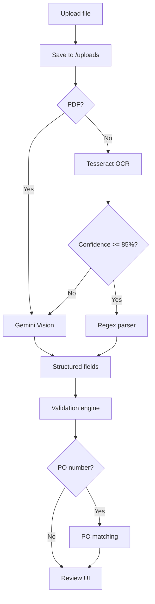

# AP Automation - Detailed Project Summary

**Templegate Accounts Payable Automation**  
Location: `c:\TemplegateR2\ap-automation`  
Stack: Next.js 14 (App Router) · MongoDB · Mongoose · JWT Auth · Hybrid OCR (Tesseract + Gemini)

---

## 1. Overview

AP Automation is a full-stack web application for managing the accounts payable lifecycle: invoice capture via OCR, validation, purchase-order matching, multi-level approval, vendor onboarding, payment processing, operational dashboards, and financial reports.

The system is designed for Indian AP workflows (GSTIN/PAN validation, INR currency, rupee formatting) with extensibility for S3 storage and production SMTP in later deployments.

### Business goals

- Reduce manual data entry through OCR on uploaded invoices
- Enforce compliance checks (GST, duplicates, vendor alignment)
- Match invoices to POs and GRNs before payment
- Route approvals by invoice amount (L1 / L2 / CFO)
- Track payments and provide aging / GST / exception reporting

---

## 2. Technology Stack

| Layer | Technology |
|-------|------------|
| Framework | Next.js 14.2 (App Router, React 18) |
| Language | JavaScript (JSX for UI, `.js` for API/lib) |
| Styling | Tailwind CSS 3.4 |
| Database | MongoDB via Mongoose 9 |
| Authentication | JWT in HTTP-only cookies (`jsonwebtoken` + `jose` for Edge middleware) |
| Password hashing | bcryptjs |
| OCR (primary) | Tesseract.js (images, server-side) |
| OCR (fallback) | Google Gemini Vision API (`@google/generative-ai`) |
| Email | Nodemailer (optional SMTP) |
| Charts | Recharts |
| File storage | Local filesystem (`/uploads/invoices/`) |

### Environment variables

| Variable | Purpose |
|----------|---------|
| `MONGODB_URI` | MongoDB connection string |
| `JWT_SECRET` | Signing secret for auth tokens |
| `JWT_EXPIRES_IN` | Token lifetime (default `7d`) |
| `NODE_ENV` | `development` / `production` |
| `SMTP_HOST`, `SMTP_PORT`, `SMTP_USER`, `SMTP_PASS`, `SMTP_FROM` | Approval & payment advice emails |
| `APP_URL` | Base URL for links in emails (default `http://localhost:3000`) |
| `GEMINI_API_KEY` | Free key from [aistudio.google.com](https://aistudio.google.com) - **required for PDFs** |
| `GEMINI_MODEL` | Default `gemini-2.0-flash` |
| `OCR_CONFIDENCE_THRESHOLD` | Tesseract → Gemini fallback below this % (default `85`) |

Copy `.env.example` to `.env.local` before running.

### Hybrid OCR pipeline

```
Upload file
     ↓
PDF? ──YES──→ Gemini Vision (always)
     ↓ NO (image)
Tesseract OCR
     ↓
Confidence ≥ threshold? ──YES──→ Use Tesseract + regex parser
     ↓ NO
Gemini Vision (fallback)
     ↓
Still empty? ──→ Tesseract best-effort + "Manual review" flag
```

| UI badge | Meaning |
|----------|---------|
| **Standard OCR** | Tesseract confidence ≥ threshold |
| **AI-enhanced** | Gemini extracted fields (PDF or low-confidence image) |
| **Manual review** | Both paths weak - verify all fields |

Implementation: `lib/ocr.js` (orchestrator) + `lib/ocr-gemini.js` (Gemini) + `lib/invoice-parser.js` (Tesseract text parsing).

---

## 3. Project Structure

```
ap-automation/
├── app/
│   ├── (auth)/                    # Login & register (no sidebar)
│   │   ├── login/page.jsx
│   │   └── register/page.jsx
│   ├── (dashboard)/               # Main app shell (sidebar + navbar)
│   │   ├── layout.jsx
│   │   ├── dashboard/page.jsx
│   │   ├── invoices/
│   │   │   ├── page.jsx
│   │   │   ├── upload/page.jsx
│   │   │   └── [id]/page.jsx
│   │   ├── vendors/
│   │   │   ├── page.jsx
│   │   │   ├── new/page.jsx
│   │   │   └── [id]/page.jsx
│   │   ├── approvals/page.jsx
│   │   ├── payments/
│   │   │   ├── page.jsx
│   │   │   └── [id]/page.jsx
│   │   └── reports/page.jsx
│   ├── api/                       # REST API route handlers
│   ├── layout.js                  # Root HTML layout
│   └── page.js                    # Redirect → /dashboard
├── components/
│   ├── layout/                    # Sidebar, Navbar
│   ├── invoices/                  # Upload, OCR editor, tables, badges
│   ├── approvals/                 # Queue, actions, chain
│   ├── vendors/                   # Form, table, onboarding
│   ├── payments/                  # Table, actions
│   ├── dashboard/                 # Stats cards, charts
│   └── reports/                   # AP aging, GST, exceptions
├── hooks/                         # useAuth, useInvoices, useVendors, etc.
├── lib/                           # Core business logic
├── models/                        # Mongoose schemas (7 collections)
├── types/index.js                 # Shared enums & constants
├── scripts/                       # Seed utilities
├── middleware.js                  # Route protection (Edge)
├── uploads/invoices/              # Uploaded files (gitignored)
└── README.md
```

---

## 4. Data Model

### 4.1 User

| Field | Type | Notes |
|-------|------|-------|
| name, email, password | String | Email unique; password hashed |
| role | Enum | `admin`, `ap_clerk`, `approver_l1`, `approver_l2`, `cfo`, `vendor_manager` |
| isActive | Boolean | Default `true` |

First registered user automatically becomes **admin**.

### 4.2 Vendor

| Field | Type | Notes |
|-------|------|-------|
| vendorCode | String | Unique, uppercase |
| name, email, phone | String | |
| gstin, pan, tin | String | Validated on save |
| bankDetails | Object | accountNo, ifsc, bankName, branch |
| status | Enum | `active`, `inactive`, `pending` |
| onboardingStatus | Enum | `draft` → `submitted` → `verified` / `rejected` |

### 4.3 Invoice

| Field | Type | Notes |
|-------|------|-------|
| invoiceNumber, poNumber, grnNumber | String | |
| vendorId | ObjectId → Vendor | |
| status | Enum | See lifecycle below |
| extractedData | Object | Dates, lineItems, subtotal, tax, total, currency, gstin, pan |
| ocrConfidence | Number | 0–100 |
| ocrMethod | Enum | `tesseract`, `gemini`, `tesseract_fallback` |
| aiEnhanced | Boolean | Gemini was used |
| requiresManualReview | Boolean | Low confidence - human verify |
| matchType | Enum | `2way`, `3way` |
| matchStatus | Enum | `unmatched`, `partial`, `matched`, `exception` |
| matchDetails | Object | PO/GRN comparison breakdown |
| approvalChain | Array | Per-step role, status, user, timestamps |
| uploadedFile | Object | path, originalName, mimeType |
| rawOcrText | String | Full OCR output |
| validationErrors, validationWarnings | String[] | |

**Invoice status lifecycle**

```
uploaded → ocr_processing → validated → pending_approval → approved → paid
                                                                    ↘ rejected
```

### 4.4 PurchaseOrder

| Field | Type |
|-------|------|
| poNumber | String (unique) |
| vendorId | ObjectId |
| lineItems[] | description, quantity, unitPrice, amount, hsnCode, taxRate |
| totalAmount | Number |
| status | `open`, `partially_matched`, `fully_matched`, `closed` |

### 4.5 GRN (Goods Receipt Note)

| Field | Type |
|-------|------|
| grnNumber | String (unique) |
| poNumber, poId, vendorId | |
| lineItems[] | description, orderedQty, receivedQty, unitPrice |
| receivedDate, status | |

### 4.6 ApprovalWorkflow

Configurable rules (default seeded):

| Amount (INR) | Approvers | Escalation SLA |
|--------------|-----------|----------------|
| 0 – 10,000 | L1 only | 48 hours |
| 10,000 – 100,000 | L1 + L2 | 48 hours |
| > 100,000 | L1 + L2 + CFO | 24 hours |

### 4.7 Payment

| Field | Type |
|-------|------|
| invoiceId, vendorId | ObjectId |
| amount, paymentDate | |
| method | `bank_transfer`, `cheque`, `upi` |
| status | `pending`, `processed`, `failed` |
| referenceNo, adviceSent | |

Created automatically when an invoice is **fully approved**.

---

## 5. Core Business Flows

### 5.1 Invoice upload → hybrid OCR → validation



1. User uploads JPEG/PNG/WebP/TIFF/**PDF** (max 10 MB).
2. Invoice record created with status `ocr_processing`.
3. **PDFs** go directly to Gemini (Tesseract cannot read PDF binaries).
4. **Images**: Tesseract runs first; if confidence &lt; `OCR_CONFIDENCE_THRESHOLD` (default 85%), Gemini runs automatically.
5. Fields mapped to `extractedData` (invoice #, dates, GSTIN, PAN, line items, totals).
6. Validation runs: mandatory fields, GSTIN checksum, PAN format, amount math, duplicates, vendor GST match.
7. If PO number present, 2-way or 3-way match runs automatically after validation.
8. **Re-run OCR**: `POST /api/invoices/[id]/reocr` after adding `GEMINI_API_KEY`.

### 5.2 PO matching

| Type | Condition | Compares |
|------|-----------|----------|
| **2-way** | PO number only | Invoice ↔ Purchase Order |
| **3-way** | GRN number set, or GRN exists for PO | Invoice ↔ PO ↔ GRN (received qty) |

Tolerance: ±₹2 or 2% on amounts. Line matching uses description similarity. Results: `matched`, `partial`, `exception`, `unmatched`.

### 5.3 Approval workflow

1. Invoice must be **validated** with no blocking validation errors.
2. **Submit for approval** builds sequential `approvalChain` from amount rules.
3. Email notification sent to users with the current pending role (console log if SMTP unset).
4. Approvers act via **Approvals** queue or invoice detail.
5. **Reject** → invoice `rejected`.
6. **Full approve** → invoice `approved`, **Payment** record created (`pending`).
7. **Escalation**: if pending step exceeds SLA hours → status `escalated`, email to admin/CFO.

### 5.4 Vendor onboarding

```
draft → Submit for review → submitted
                              ↓
                    vendor_manager / admin
                              ↓
                    verify → active + verified
                    reject → inactive + rejected
```

### 5.5 Payment processing

1. Pending payment appears after full approval.
2. AP enters reference/UTR, method, date.
3. **Mark processed** → payment `processed`, invoice `paid`, optional payment advice email to vendor.
4. **Mark failed** → payment `failed`, invoice reverts to `approved` if was paid.

---

## 6. API Reference

### Authentication

| Method | Endpoint | Description |
|--------|----------|-------------|
| POST | `/api/auth/register` | Create user (first user = admin) |
| POST | `/api/auth/login` | Login, set cookie |
| POST | `/api/auth/logout` | Clear cookie |
| GET | `/api/auth/me` | Current session user |

### Invoices

| Method | Endpoint | Description |
|--------|----------|-------------|
| GET | `/api/invoices` | List (`?status`, `?q`, `?page`, `?limit`) |
| POST | `/api/invoices/upload` | Multipart upload + hybrid OCR |
| POST | `/api/invoices/[id]/reocr` | Re-run OCR on existing file |
| GET | `/api/invoices/[id]` | Detail |
| PUT | `/api/invoices/[id]` | Update fields / validate |
| DELETE | `/api/invoices/[id]` | Delete |
| GET | `/api/invoices/[id]/file` | Download/view file |
| POST | `/api/invoices/[id]/validate` | Re-run validation |
| POST | `/api/invoices/[id]/match` | Re-run PO matching |
| POST | `/api/invoices/[id]/submit-for-approval` | Start approval chain |
| PUT | `/api/invoices/[id]/approve` | `{ action: "approve"\|"reject", remarks }` |
| GET | `/api/invoices/[id]/payment` | Linked payment |

### Vendors

| Method | Endpoint | Description |
|--------|----------|-------------|
| GET | `/api/vendors` | List (`?q`, `?status`, `?activeOnly`) |
| POST | `/api/vendors` | Create |
| GET/PUT/DELETE | `/api/vendors/[id]` | CRUD |
| POST | `/api/vendors/[id]/onboarding` | `{ action: "submit"\|"verify"\|"reject" }` |

### Purchase orders & GRNs

| Method | Endpoint | Description |
|--------|----------|-------------|
| GET/POST | `/api/purchase-orders` | List / create PO |
| GET/POST | `/api/grns` | List / create GRN |

### Payments

| Method | Endpoint | Description |
|--------|----------|-------------|
| GET | `/api/payments` | List (`?status`, `?vendorId`) |
| POST | `/api/payments` | Create for approved invoice |
| GET/PUT | `/api/payments/[id]` | Detail / process / advice |

### Approvals & analytics

| Method | Endpoint | Description |
|--------|----------|-------------|
| GET | `/api/approvals` | Current user's approval queue |
| GET | `/api/dashboard/stats` | KPIs, aging, vendor spend |
| GET | `/api/reports` | `?type=all\|aging\|gst\|exceptions` |

All API routes except login/register require a valid `ap_auth_token` cookie (enforced in `middleware.js`).

---

## 7. UI Pages

| Route | Purpose |
|-------|---------|
| `/login`, `/register` | Authentication |
| `/dashboard` | KPI cards, aging chart, vendor chart, status breakdown |
| `/invoices` | Searchable invoice list |
| `/invoices/upload` | Drag-and-drop upload |
| `/invoices/[id]` | OCR review, validation, matching, approval, payment card |
| `/vendors` | Vendor directory |
| `/vendors/new` | Create vendor |
| `/vendors/[id]` | Edit + onboarding actions |
| `/approvals` | Approval queue with approve/reject |
| `/payments` | Payment list |
| `/payments/[id]` | Process payment |
| `/reports` | AP aging, GST summary, exceptions (CSV export) |

---

## 8. Key Libraries (`lib/`)

| File | Responsibility |
|------|----------------|
| `mongodb.js` | Connection singleton |
| `auth.js` / `auth-edge.js` / `auth-constants.js` | JWT sign/verify (Node + Edge) |
| `api-auth.js` | Session user from cookie |
| `upload.js` | File save & read under `/uploads` |
| `ocr.js` | Hybrid OCR orchestrator (`extractInvoiceData`) |
| `ocr-gemini.js` | Gemini Vision extraction + JSON mapping |
| `invoice-parser.js` | Tesseract raw text → structured fields |
| `validators.js` | GSTIN, PAN, amounts |
| `invoice-validation.js` | Full invoice validation + trigger PO match |
| `po-matching.js` | 2-way / 3-way matching |
| `approval.js` | Chain build, approve/reject, escalation |
| `mailer.js` | Nodemailer with SMTP fallback logging |
| `vendor-validation.js` | Vendor field validation |
| `payment-serialize.js` | API response shaping |
| `dashboard-stats.js` | Dashboard aggregations |
| `reports.js` | AP aging, GST, exceptions reports |
| `export-csv.js` | Client-side CSV download helper |

---

## 9. Security

- **Passwords**: bcrypt (12 rounds), never returned in API responses.
- **Sessions**: HTTP-only JWT cookie; `secure` flag in production.
- **Middleware**: Protects dashboard routes and `/api/*` except login/register/logout.
- **Authorization**: Role checks on approval steps, vendor delete, onboarding verify/reject.
- **File access**: Invoice files served only to authenticated users via API (path traversal prevented in `upload.js`).
- **Upload limits**: MIME whitelist, 10 MB max.

---

## 10. Seed Scripts & Demo Data

Run from `ap-automation/` with MongoDB up:

```bash
node scripts/seed-default-workflow.js   # Approval matrix rules
node scripts/seed-approver-users.js     # l1@demo.local, l2@demo.local, cfo@demo.local (Approver@123)
node scripts/seed-sample-po.js            # DEMO-001 vendor, PO-2024-1001, GRN-2024-5001
```

**Sample PO matching test**

- PO: `PO-2024-1001`
- GRN: `GRN-2024-5001`
- Invoice total: `42500` (for full match with seeded line items)

---

## 11. Build & Deployment

### Development

```bash
cd ap-automation
npm install
npm run dev
```

Open http://localhost:3000

### Production build (verified)

```bash
npm run build
npm start
```

Build output: **28 pages**, **24+ API routes**, middleware ~32 KB.

### Production considerations

| Item | Recommendation |
|------|----------------|
| File storage | Swap `lib/upload.js` to S3 / Azure Blob |
| MongoDB | Use Atlas with replica set |
| OCR | Consider dedicated worker or queue for large volumes |
| Email | Configure SMTP + `APP_URL` for production domain |
| Node.js | Mongoose 9 recommends Node ≥ 20.19 |
| HTTPS | Required for secure cookies in production |

---

## 12. Module Delivery Checklist

| # | Module | Status |
|---|--------|--------|
| 1 | Project setup, auth, middleware, models | ✅ Complete |
| 2 | Mongoose schemas (7 models) | ✅ Complete |
| 3 | Invoice upload + OCR | ✅ Complete |
| 4 | Validation engine | ✅ Complete |
| 5 | PO matching (2-way & 3-way) | ✅ Complete |
| 6 | Approval workflow + notifications | ✅ Complete |
| 7 | Vendor CRUD + onboarding | ✅ Complete |
| 8 | Payments | ✅ Complete |
| 9 | Dashboard + charts | ✅ Complete |
| 10 | Reports (aging, GST, exceptions) | ✅ Complete |
| 11 | UI wired to APIs | ✅ Complete |

---

## 13. Known Limitations & Future Enhancements

- **Gemini API key**: PDF uploads fail without `GEMINI_API_KEY` in `.env.local` (free tier at Google AI Studio).
- **Gemini quotas**: Free tier limits (~1500 requests/day); tune `OCR_CONFIDENCE_THRESHOLD` upward to reduce AI calls on clean scans.
- **shadcn/ui**: Plan referenced shadcn; UI uses Tailwind custom components (can migrate later).
- **Background jobs**: OCR and escalation run synchronously in request cycle; high volume should use a job queue.
- **Audit log**: No dedicated audit collection yet; approval remarks and timestamps provide partial trail.
- **Multi-tenant**: Single-organization design; no tenant isolation.
- **GST filing export**: GST report is operational summary, not a statutory GSTR filing format.

---

## 14. Quick Reference - User Roles

| Role | Typical actions |
|------|-----------------|
| `admin` | Full access, can approve any step, delete vendors |
| `ap_clerk` | Upload invoices, edit data, submit for approval |
| `approver_l1` | Approve tier-1 queue items |
| `approver_l2` | Approve tier-2 queue items |
| `cfo` | Approve high-value invoices |
| `vendor_manager` | Vendor onboarding verify/reject, vendor delete |

---

*Document generated for Templegate AP Automation - reflects implementation in `ap-automation` as of project completion.*
